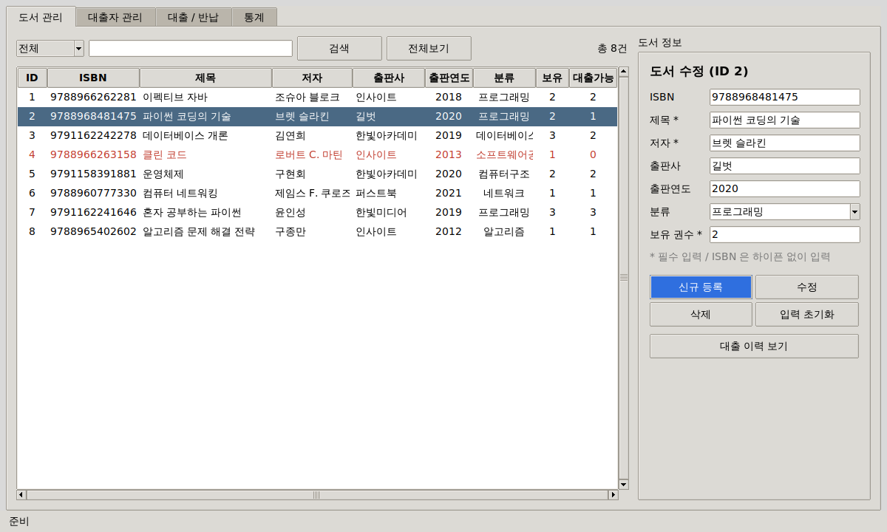
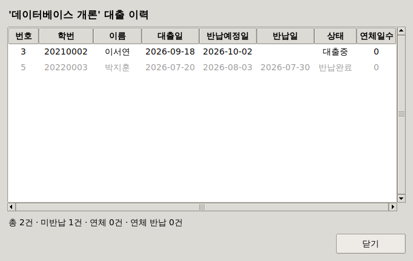
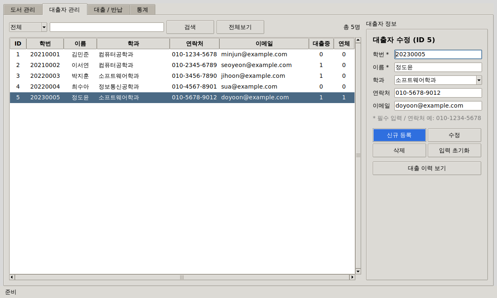
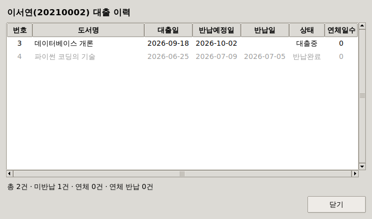
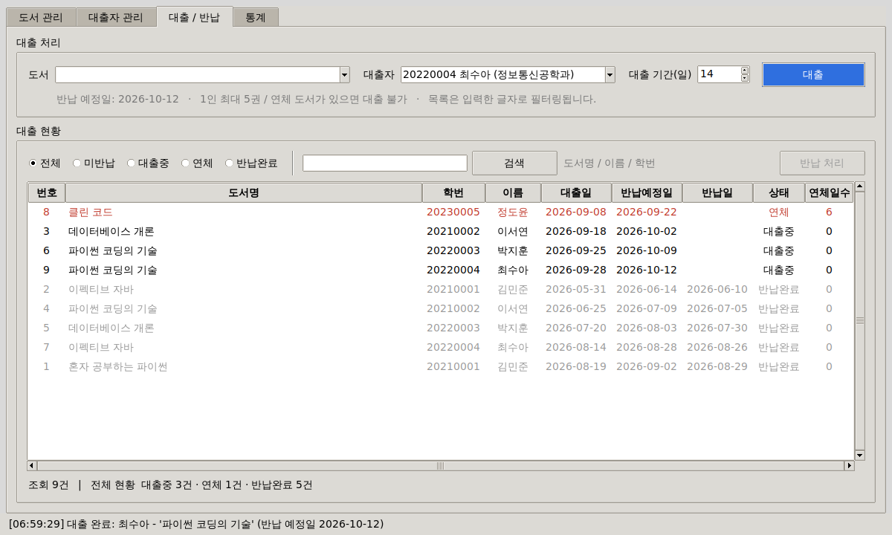
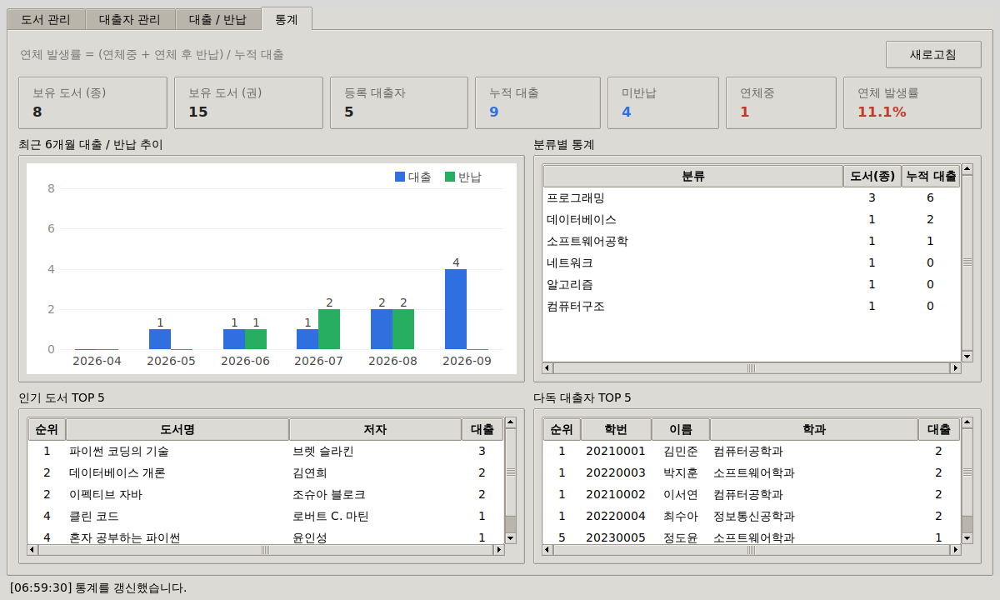
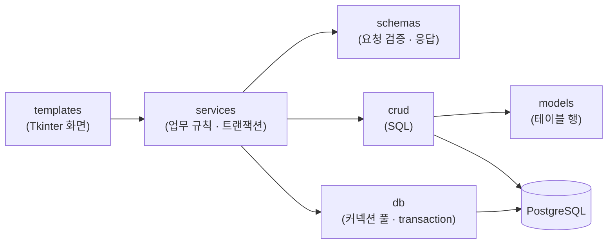
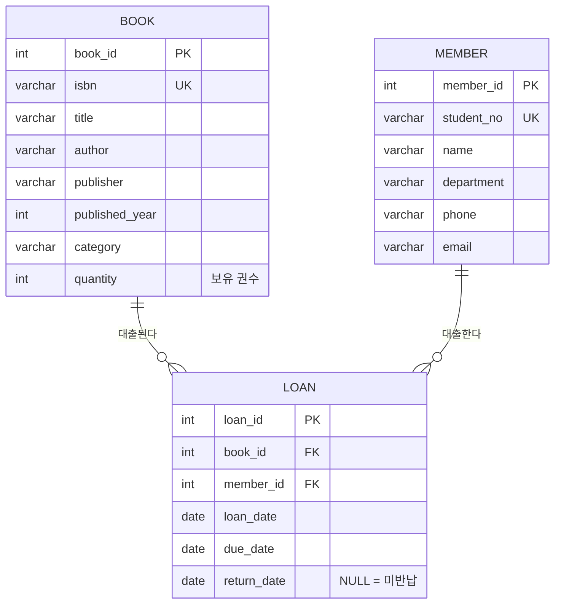

# 도서 대출 관리 시스템

## 📁 프로젝트 개요

+ **도서 대출 관리 시스템**은 학과 및 소규모 도서 공간에서 도서 대출/반납 현황을 수기로 관리할 때 발생하는 비효율을 개선하기 위한 **Python GUI(Tkinter) 데스크톱 프로그램**입니다.
+ 도서 정보와 대출 기록을 **PostgreSQL** 데이터베이스로 관리하고, GUI 화면에서 **등록/조회/수정/삭제(CRUD)** 를 직관적으로 처리할 수 있습니다.
+ 대출 상태(**대출중 / 연체 / 반납완료**)는 조회 시점의 날짜로 계산하여 실시간으로 확인할 수 있으며, 대출 현황 검색·필터링과 도서/대출 이력 통계 화면을 제공합니다.
+ 백엔드 개발 역량(DB 설계, CRUD, 트랜잭션 처리)을 GUI 환경에서 실습하는 것을 목표로 하며, 대출 처리 시 행 잠금(`SELECT ... FOR UPDATE`)으로 동시 대출 시에도 재고가 초과 대출되지 않도록 설계했습니다.

## 🤝 팀 소개

<table border="1">
    <thead>
        <tr><td align="center">도서 대출 관리 시스템</td></tr>
    </thead>
    <tr align="center">
        <td>손수호</td>
    </tr>
    <tr>
        <td>
            <a href=https://github.com/Hasegos>
                
            </a>
        </td>
    </tr>
</table>

## 🛠️ 기술 스택

+ **Language**: 
+ **GUI**: 
+ **Database**: 
+ **DB Driver**:  — 커넥션 풀(`SimpleConnectionPool`), 트랜잭션 컨텍스트 매니저
+ **차트**: 외부 라이브러리 없이 Tkinter `Canvas` 로 직접 구현

## ✨ 핵심 기능

### 1) 도서 / 대출자 관리
+ 도서·대출자 등록/수정/삭제(CRUD) 및 항목별(제목·저자·ISBN·출판사·분류 / 학번·이름·학과·연락처) 부분 일치 검색.
+ 필수값·길이·숫자 범위·ISBN/연락처/이메일 형식 검증, ISBN·학번 중복 시 안내 메시지 표시.
+ 대출중인 도서·대출자는 삭제 불가, 대출중 권수보다 보유 권수를 줄이는 수정 차단.
+ 목록 더블클릭 또는 '대출 이력 보기' 버튼으로 도서별/대출자별 전체 대출 이력 팝업 제공.

### 2) 대출 / 반납 처리
+ 대출 가능한 도서와 대출자를 입력한 글자로 필터링하며 선택, 대출 기간 설정 및 반납 예정일 미리보기.
+ 상태 필터(전체/미반납/대출중/연체/반납완료)와 도서명·이름·학번 검색, 연체 건 빨간색·반납완료 건 회색 구분.
+ 반납 처리 시 연체일수 자동 계산 및 안내.

### 3) 통계
+ 보유 도서(종/권), 등록 대출자, 누적 대출, 미반납, 연체중, 연체 발생률 요약 카드.
+ 최근 6개월 월별 대출/반납 추이 막대 차트, 분류별 통계, 인기 도서·다독 대출자 TOP 5.
+ 모든 집계를 `REPEATABLE READ READ ONLY` 트랜잭션으로 조회해 같은 시점의 수치를 보장.

### 4) 대출 규칙

| 규칙 | 처리 |
|---|---|
| 재고 확인 | 대출 가능 권수(`보유 권수 - 미반납 건수`)가 0이면 대출 불가 |
| 1인 대출 한도 | 미반납 도서가 5권 이상이면 대출 불가 |
| 연체자 제한 | 연체중인 도서가 있으면 반납 전까지 대출 불가 |
| 중복 대출 | 같은 대출자가 동일 도서를 반납 전에 다시 대출 불가 |
| 대출 기간 | 1 ~ 90일 (기본 14일) |

## 🖼️ 화면 구성

### 도서 관리



- 메인 담당자 : 손수호
- 주요 개발 기능 : 도서 등록/수정/삭제, 항목별 검색 및 헤더 클릭 정렬, 대출 가능 권수 표시(재고 없음 빨간색), 도서별 대출 이력 팝업

---

### 대출자 관리



- 메인 담당자 : 손수호
- 주요 개발 기능 : 대출자 등록/수정/삭제, 학번·연락처·이메일 형식 검증, 대출중/연체 권수 집계(연체자 빨간색), 대출자별 대출 이력 팝업

---

### 대출 / 반납


- 메인 담당자 : 손수호
- 주요 개발 기능 : 검색 가능한 도서·대출자 선택, 대출 기간·반납 예정일 안내, 상태 필터 및 키워드 검색, 반납 처리 및 연체일수 계산

---

### 통계


- 메인 담당자 : 손수호
- 주요 개발 기능 : 요약 카드 7종, 최근 6개월 대출/반납 추이 차트(Canvas), 분류별 통계, 인기 도서·다독 대출자 TOP 5

## 🧱 계층 구조

+ 화면(templates)은 SQL 을 직접 실행하지 않고 services 를 통해서만 DB 에 접근하며, 각 폴더는 한 가지 역할만 담당합니다.



## 📊 ERD (Entity Relationship Diagram)



### 📚 Book (도서)
| 필드명 | 타입 | 설명 |
|---|---|---|
| book_id | SERIAL | PK |
| isbn | VARCHAR(20) | ISBN 10/13자리 (unique, 선택) |
| title / author | VARCHAR | 제목, 저자 (필수) |
| publisher / category | VARCHAR | 출판사, 분류 |
| published_year | INTEGER | 출판연도 (1000~9999) |
| quantity | INTEGER | 보유 권수 (1 이상) |
| created_at / updated_at | TIMESTAMP | 등록/수정 시각 |

### 🎓 Member (대출자)
| 필드명 | 타입 | 설명 |
|---|---|---|
| member_id | SERIAL | PK |
| student_no | VARCHAR(20) | 학번 (unique, 필수) |
| name | VARCHAR(50) | 이름 (필수) |
| department | VARCHAR(100) | 학과 |
| phone / email | VARCHAR | 연락처, 이메일 (형식 검증) |
| created_at / updated_at | TIMESTAMP | 등록/수정 시각 |

### 📝 Loan (대출 기록)
| 필드명 | 타입 | 설명 |
|---|---|---|
| loan_id | SERIAL | PK |
| book_id / member_id | INTEGER | 도서 FK, 대출자 FK (ON DELETE CASCADE) |
| loan_date | DATE | 대출일 |
| due_date | DATE | 반납 예정일 (대출일 이후) |
| return_date | DATE | 반납일 (NULL = 미반납) |

+ 대출 상태는 별도 컬럼 없이 계산: `return_date` 존재 → **반납완료** / `due_date < 오늘` → **연체** / 그 외 → **대출중**
+ 대출 가능 권수 = `book.quantity - 미반납 대출 건수`
+ 미반납 대출 조회(대출중/연체 필터) 최적화를 위해 부분 인덱스(`WHERE return_date IS NULL`)를 사용합니다.

## 🔒 데이터 무결성 / 동시성

+ **트랜잭션**: 모든 DB 작업은 `transaction()` 컨텍스트 매니저 안에서 실행되어 정상 종료 시 commit, 예외 발생 시 rollback 됩니다.
+ **동시성 제어**: 대출 처리 시 도서 → 대출자 순서로 `SELECT ... FOR UPDATE` 행 잠금 후 재고·한도를 검사하여, 여러 사용자가 동시에 마지막 1권을 대출해도 1건만 성공합니다. 잠금 순서를 고정해 교착 상태(Deadlock)를 방지합니다.
+ **제약 조건**: ISBN·학번 UNIQUE, 보유 권수·출판연도·반납일 CHECK, 대출 기록 FK 제약으로 DB 단에서도 잘못된 데이터를 차단합니다.
+ **SQL Injection 방지**: 모든 값은 파라미터 바인딩으로 전달하고, 검색 기준 컬럼명은 화이트리스트에서만 가져옵니다.
+ **접속 오류 안내**: 한글 Windows 용 PostgreSQL 의 접속 오류 메시지(CP949) 디코딩 오류를 처리해 실제 원인(예: 비밀번호 인증 실패)을 안내합니다.

## 📁 디렉토리 구조

```text
📦 python-gui-project/
├── 🚀 main.py                   # 프로그램 실행 진입점 (DB 연결 확인 → 테이블 자동 생성 → 메인 윈도우)
├── 📄 requirements.txt
├── ⚙️ core/                     # 설정, 상수, 로거, 도메인 예외, 화면 공통 스타일
│   ├── config.py                # DB 접속 정보, 커넥션 풀, 대출 정책 설정
│   ├── exceptions.py            # LibraryError / ValidationError / NotFoundError
│   ├── logger.py                # 공용 로거
│   ├── templates.py             # 화면 공통 테마·폰트
│   └── constants/               # loan.py(대출 상태·필터·통계), ui.py(창 크기·색상·폰트)
├── 🗄️ db/                       # 커넥션 풀·transaction(), 스키마/샘플 SQL, 초기화
│   ├── session.py
│   ├── init_db.py
│   ├── schema.sql
│   └── sample_data.sql
├── 🧾 models/                   # 테이블 한 행을 표현하는 dataclass (Book, Member, Loan)
├── 🧩 schemas/                  # 입력값 검증 요청 스키마, 처리 결과·통계 응답 스키마
├── 💾 crud/                     # 테이블별 SQL 실행 (book / member / loan / stats)
├── 🔄 services/                 # 업무 규칙 검사, 트랜잭션 경계, 처리 로그
├── 🖥️ templates/                # Tkinter 화면
│   ├── main_window.py           # 탭 기반 메인 윈도우
│   ├── widgets.py               # DataTable, FormFields, SearchBar, SearchableCombobox
│   ├── history_dialog.py        # 도서/대출자 대출 이력 팝업
│   ├── book_view.py
│   ├── member_view.py
│   ├── loan_view.py
│   └── stats_view.py
└── 🖼️ img/                      # README 화면 캡처
```

## 🌿 브랜치 전략

| 브랜치 | 용도 |
|---|---|
| `master` | 배포(안정) 브랜치 |
| `dev` | 개발 통합 브랜치 |
| `feature/gui-기능` | 기능 단위 개발 브랜치, 완료 후 `dev` 로 PR/merge |

## 🚀 실행 방법

```bash
# 1. 의존성 설치
python -m pip install -r requirements.txt

# 2. PostgreSQL 에 library 데이터베이스 생성
createdb -U postgres library

# 3. 실행 (테이블 자동 생성, DB 가 비어 있으면 샘플 데이터 자동 입력)
python main.py
```

+ 반드시 프로젝트 루트에서 실행합니다.
+ 테이블만 따로 만들거나 샘플 데이터를 수동으로 넣으려면 `python -m db.init_db [--sample]` 을 실행합니다.
