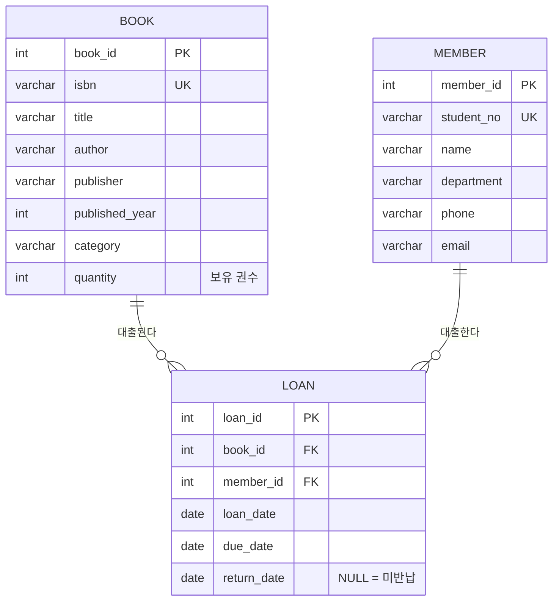
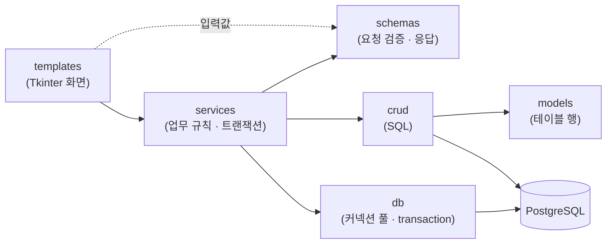

# 도서 대출 관리 시스템

Python Tkinter 기반 GUI와 PostgreSQL을 연동한 도서 대출 관리 프로그램입니다.

학과 및 소규모 도서 공간에서 도서 대출/반납 현황을 수기로 관리할 때 발생하는 비효율을 개선하고,
DB 설계·CRUD·트랜잭션 처리를 GUI 환경에서 실습하는 것을 목표로 합니다.

## 주요 기능

- 도서 등록/수정/삭제 및 목록 조회
- 대출자 정보 등록 및 대출/반납 처리
- 대출 현황 검색 및 필터링(대출중, 연체 등)
- 도서/대출 이력 통계 화면

## 기술 스택

| 구분 | 사용 기술 |
| --- | --- |
| Language | Python 3.10+ |
| GUI | Tkinter (ttk) |
| Database | PostgreSQL |
| DB Driver | psycopg2 |

## 브랜치 전략

| 브랜치 | 용도 |
| --- | --- |
| `master` | 배포(안정) 브랜치 |
| `dev` | 개발 통합 브랜치 |
| `feature/gui-기능` | 기능 단위 개발 브랜치, 완료 후 `dev`로 PR/merge |

## ERD



- 대출 상태는 별도 컬럼 없이 계산: `return_date` 존재 → 반납완료 / `due_date < 오늘` → 연체 / 그 외 → 대출중
- 대출 가능 권수 = `book.quantity - 미반납 대출 건수`

## 실행 방법

```bash
# 1. 의존성 설치
pip install -r requirements.txt

# 2. PostgreSQL 데이터베이스 생성
createdb -U postgres library

# 3. 접속 정보 설정 (LIBRARY_DB_PASSWORD 를 설치 시 정한 postgres 비밀번호로 수정)
cp .env.example .env          # Windows: copy .env.example .env

# 4. 프로그램 실행 (테이블 자동 생성, DB 가 비어 있으면 샘플 데이터 자동 입력)
python main.py
```

- 테이블만 따로 만들거나 샘플 데이터를 수동으로 넣으려면 `python -m db.init_db [--sample]` 을 실행합니다.
- 한글 Windows 용 PostgreSQL 은 접속 오류 메시지를 CP949 로 보내 `UnicodeDecodeError` 가 발생할 수 있어, 이를 원래 오류 메시지(예: 비밀번호 인증 실패)로 복원해 안내합니다.

DB 접속 정보와 대출 정책은 `.env` 파일 또는 환경 변수로 변경할 수 있습니다. (환경 변수가 우선)

| 환경 변수 | 기본값 | 설명 |
| --- | --- | --- |
| `LIBRARY_DB_HOST` | `localhost` | DB 호스트 |
| `LIBRARY_DB_PORT` | `5432` | DB 포트 |
| `LIBRARY_DB_NAME` | `library` | DB 이름 |
| `LIBRARY_DB_USER` | `postgres` | DB 사용자 |
| `LIBRARY_DB_PASSWORD` | `postgres` | DB 비밀번호 |
| `LIBRARY_POOL_MIN` / `LIBRARY_POOL_MAX` | `1` / `5` | 커넥션 풀 크기 |
| `LIBRARY_LOAN_DAYS` | `14` | 기본 대출 기간(일) |
| `LIBRARY_MAX_LOANS` | `5` | 1인 최대 대출 권수 |
| `LIBRARY_AUTO_SAMPLE` | `true` | 실행 시 DB 가 비어 있으면 샘플 데이터 자동 입력 |

## 아키텍처



| 폴더 | 역할 |
| --- | --- |
| `core` | 설정(`config`), 상수(`constants`), 로거, 도메인 예외, 화면 공통 스타일(`templates.py`) |
| `db` | 커넥션 풀·`transaction()`(commit/rollback), 스키마/샘플 SQL, 초기화 스크립트 |
| `models` | 테이블 한 행을 표현하는 dataclass (`Book`, `Member`, `Loan`) |
| `schemas` | 화면 입력값 검증 요청 스키마(`BookRequest` 등)와 처리 결과·통계 응답 스키마 |
| `crud` | 테이블별 SQL 실행 (파라미터 바인딩으로 SQL Injection 방지), 결과를 model/schema 로 변환 |
| `services` | 업무 규칙 검사, 트랜잭션 경계 관리, 처리 로그 기록 |
| `templates` | Tkinter 화면(View)과 공통 위젯 |

## 대출 규칙

| 규칙 | 처리 |
| --- | --- |
| 재고 확인 | 대출 가능 권수(`보유 권수 - 미반납 건수`)가 0이면 대출 불가 |
| 1인 대출 한도 | 미반납 도서가 `LIBRARY_MAX_LOANS`(기본 5권) 이상이면 대출 불가 |
| 연체자 제한 | 연체중인 도서가 있으면 반납 전까지 대출 불가 |
| 중복 대출 | 같은 대출자가 동일 도서를 반납 전에 다시 대출 불가 |
| 동시성 | 대출 트랜잭션에서 도서 → 대출자 순서로 `SELECT ... FOR UPDATE` 잠금 후 검사 |

## 화면 구성

| 탭 | 기능 |
| --- | --- |
| 도서 관리 | 도서 등록/수정/삭제, 전체·제목·저자·ISBN·출판사·분류 검색, 대출 가능 권수 표시, 도서별 대출 이력 팝업 |
| 대출자 관리 | 대출자 등록/수정/삭제, 학번·이름·학과·연락처 검색, 대출중/연체 권수 표시, 대출자별 대출 이력 팝업 |
| 대출 / 반납 | 도서·대출자 선택 후 대출, 반납 처리, 상태 필터(전체/미반납/대출중/연체/반납완료) 및 키워드 검색 |
| 통계 | 요약 지표, 최근 6개월 대출/반납 추이 차트, 분류별 통계, 인기 도서·다독 대출자 TOP 5 |

> 도서/대출자 목록에서 행을 **더블클릭**하거나 **대출 이력 보기** 버튼을 누르면 이력 팝업이 열립니다.

## 프로젝트 구조

```
python-gui-project/
├── main.py                      # 프로그램 실행 진입점
├── requirements.txt
├── .env.example                 # 접속 정보 예시 (.env 로 복사해 사용)
├── core/
│   ├── config.py                # .env / 환경 변수 → settings
│   ├── exceptions.py            # LibraryError, ValidationError, NotFoundError
│   ├── logger.py                # 공용 로거
│   ├── templates.py             # 화면 공통 스타일(테마, 폰트)
│   └── constants/
│       ├── loan.py              # 대출 상태, 필터, 기간 범위, 통계 설정
│       └── ui.py                # 창 크기, 색상, 폰트 크기
├── db/
│   ├── session.py               # 커넥션 풀, transaction()
│   ├── init_db.py               # 테이블 자동 생성, 샘플 데이터 입력
│   ├── schema.sql
│   └── sample_data.sql
├── models/
│   ├── book_model.py
│   ├── member_model.py
│   └── loan_model.py
├── schemas/
│   ├── common_schema.py         # 공통 입력값 검증 함수
│   ├── book_schema.py
│   ├── member_schema.py
│   ├── loan_schema.py
│   └── stats_schema.py
├── crud/
│   ├── common_crud.py           # LIKE 패턴, 검색 조건 생성
│   ├── book_crud.py
│   ├── member_crud.py
│   ├── loan_crud.py
│   └── stats_crud.py
├── services/
│   ├── book_service.py
│   ├── member_service.py
│   ├── loan_service.py
│   └── stats_service.py
└── templates/
    ├── main_window.py           # 탭 기반 메인 윈도우
    ├── widgets.py               # DataTable, FormFields, SearchBar, SearchableCombobox
    ├── history_dialog.py        # 도서/대출자 대출 이력 팝업
    ├── book_view.py
    ├── member_view.py
    ├── loan_view.py
    └── stats_view.py
```

> `__init__.py` 없이 네임스페이스 패키지로 구성되어 있으므로, 반드시 프로젝트 루트에서 실행합니다.
