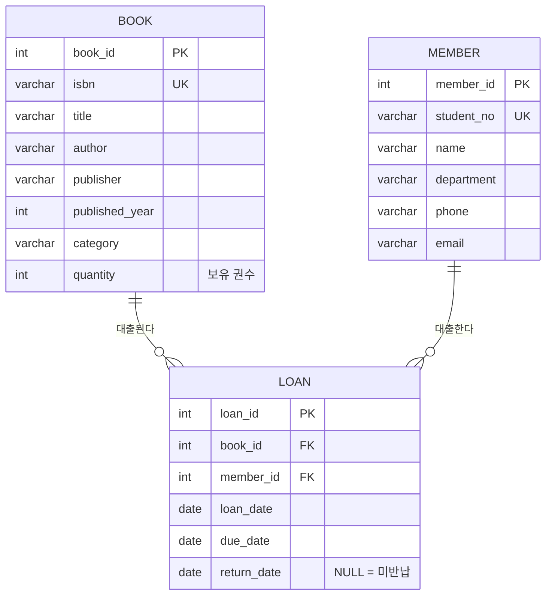
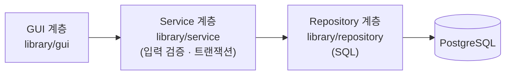

# 도서 대출 관리 시스템

Python Tkinter 기반 GUI와 PostgreSQL을 연동한 도서 대출 관리 프로그램입니다.

학과 및 소규모 도서 공간에서 도서 대출/반납 현황을 수기로 관리할 때 발생하는 비효율을 개선하고,
DB 설계·CRUD·트랜잭션 처리를 GUI 환경에서 실습하는 것을 목표로 합니다.

## 주요 기능

- 도서 등록/수정/삭제 및 목록 조회
- 대출자 정보 등록 및 대출/반납 처리
- 대출 현황 검색 및 필터링(대출중, 연체 등)
- 도서/대출 이력 통계 화면

## 기술 스택

| 구분 | 사용 기술 |
| --- | --- |
| Language | Python 3.10+ |
| GUI | Tkinter (ttk) |
| Database | PostgreSQL |
| DB Driver | psycopg2 |

## 브랜치 전략

| 브랜치 | 용도 |
| --- | --- |
| `master` | 배포(안정) 브랜치 |
| `dev` | 개발 통합 브랜치 |
| `feature/gui-기능` | 기능 단위 개발 브랜치, 완료 후 `dev`로 PR/merge |

## ERD



- 대출 상태는 별도 컬럼 없이 계산: `return_date` 존재 → 반납완료 / `due_date < 오늘` → 연체 / 그 외 → 대출중
- 대출 가능 권수 = `book.quantity - 미반납 대출 건수`

## 실행 방법

```bash
# 1. 의존성 설치
pip install -r requirements.txt

# 2. PostgreSQL 데이터베이스 생성
createdb -U postgres library

# 3. 스키마 생성 (+ 샘플 데이터)
python init_db.py --sample

# 4. 프로그램 실행
python main.py
```

DB 접속 정보는 환경 변수로 변경할 수 있습니다.

| 환경 변수 | 기본값 | 설명 |
| --- | --- | --- |
| `LIBRARY_DB_HOST` | `localhost` | DB 호스트 |
| `LIBRARY_DB_PORT` | `5432` | DB 포트 |
| `LIBRARY_DB_NAME` | `library` | DB 이름 |
| `LIBRARY_DB_USER` | `postgres` | DB 사용자 |
| `LIBRARY_DB_PASSWORD` | `postgres` | DB 비밀번호 |
| `LIBRARY_LOAN_DAYS` | `14` | 기본 대출 기간(일) |
| `LIBRARY_MAX_LOANS` | `5` | 1인 최대 대출 권수 |

## 아키텍처



| 계층 | 역할 |
| --- | --- |
| GUI | Tkinter 화면 구성, 사용자 입력 전달, 오류 메시지 안내 |
| Service | 입력값 검증, 업무 규칙 확인, `transaction()` 으로 commit/rollback 경계 관리 |
| Repository | 테이블별 SQL 실행 (파라미터 바인딩으로 SQL Injection 방지) |

## 대출 규칙

| 규칙 | 처리 |
| --- | --- |
| 재고 확인 | 대출 가능 권수(`보유 권수 - 미반납 건수`)가 0이면 대출 불가 |
| 1인 대출 한도 | 미반납 도서가 `LIBRARY_MAX_LOANS`(기본 5권) 이상이면 대출 불가 |
| 연체자 제한 | 연체중인 도서가 있으면 반납 전까지 대출 불가 |
| 중복 대출 | 같은 대출자가 동일 도서를 반납 전에 다시 대출 불가 |
| 동시성 | 대출 트랜잭션에서 도서 → 대출자 순서로 `SELECT ... FOR UPDATE` 잠금 후 검사 |
